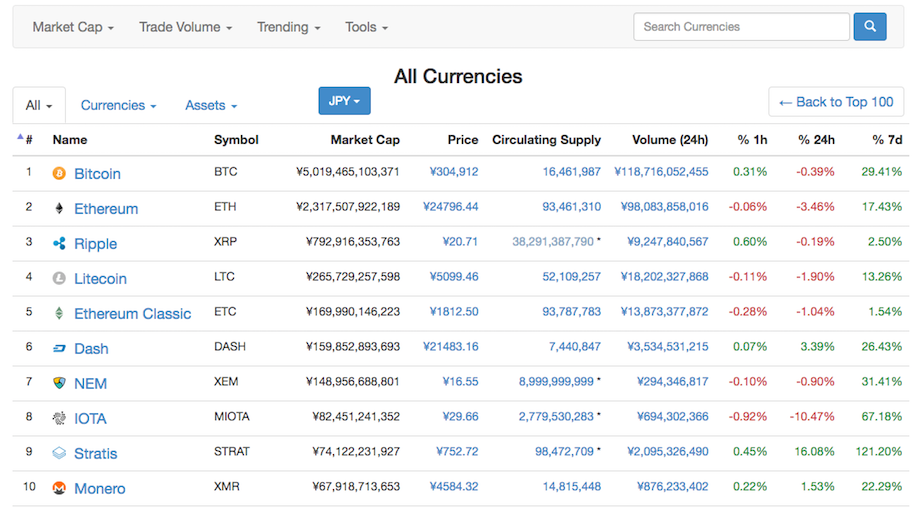

最近、ニュースで取り上げられるビットコインですが、その取引を始める方法はいくつかあります。
その方法を大きく分けて２つ紹介したいと思います。

 
## ビットコインを購入する  

こちらは、外国為替を買うのと同じように、ビットコインを取引しているところで購入することができます。

 
図は現在のビットコインとその他の主要な仮想通貨の価格一覧がこちらになります。

[https://coinmarketcap.com/all/views/all/#JPY](https://coinmarketcap.com/all/views/all/#JPY)

（※2017年7月22日現在）
 

Market Capとは時価総額のことでビットコインが断トツ１位の約５兆円という状況です。  
Circulating Supplyとは貨幣供給量のことで、貨幣供給量と価格をかけたものが時価総額となります。  
近年では、Ethereum（イーサリアム）の上昇率も目立っています。  

 
## ビットコインをマイニング（採掘）する

ビットコインは取引所で購入するだけでなく、マイニング（採掘）という方法で、手に入れることができます。

図は現在のビットコインのマイニングプールの分布図となります。

[https://blockchain.info/ja/pools](https://blockchain.info/ja/pools)

2017年7月22日現在

マイニングプールでは、日々ビットコインの取引をコンピュータを使って計算しています。
日々コンピュータを使って取引を計算してくれる報酬として、ビットコインを受け取ることができます。

 
 
近年では、このマイニングプールに参加してビットコインを日々受け取ることができます。

 

今年は、仮想通貨元年といわれるぐらいビットコインの注目が高まっています。
興味を持たれた方は、ぜひビットコインの取引を始めてみるのはいかがでしょうか？
